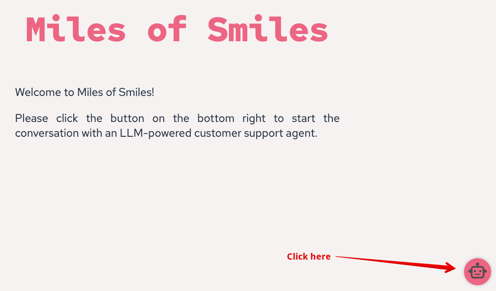
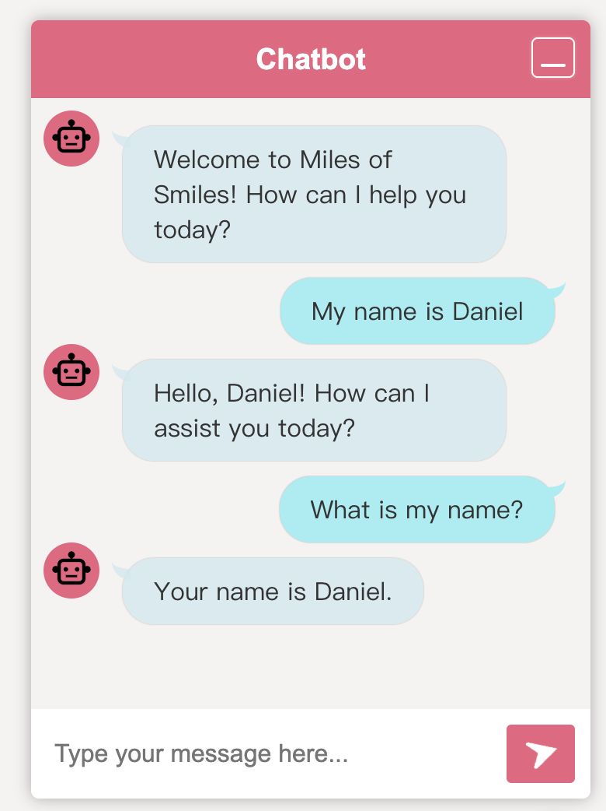

# Quarkus LangChain4j Generative AI Chatbot

This AI chatbot application is built on the [Quarkus LangChain4j](https://docs.quarkiverse.io/quarkus-langchain4j/dev/index.html) extension to interact with OpenAI's GPT-4o model.

## 1. Running the Quarkus LangChain4j AI Chatbot application locally

Note that you need to set the environment variable `OPENAI_API_KEY` with your OpenAI API key.

```shell
export OPENAI_API_KEY="YOUR_OPENAI_API_KEY"
```

Run the application with the following command:

```shell
./mvnw quarkus:dev
```

**Note:** You may get a `mvnw permission issue` error. If you run into an error about the `mvnw` maven wrapper, you can give execution permission for the file by navigating to the project folder and executing `chmod +x mvnw`.

**Note:** You may get the error, `Could not expand value OPENAI_API_KEY`. If you run into an error indicating `java.util.NoSuchElementException: SRCFG00011: Could not expand value OPENAI_API_KEY in property quarkus.langchain4j.openai.api-key`, make sure you have set the environment variable `OPENAI_API_KEY` with your OpenAI API key.

Access the [Chatbot homepage](http://localhost:8080). 

Start chatting by clicking the red robot icon in the corner.



## 2. Having chats with the chatbot

This chatbot leverages GPT-4o (from OpenAI) through our backend. Test it and see its memory in action.

For example, let's start a conversation with the chatbot.

```
User: My name is Daniel.

AI: Hi Daniel, nice to meet you.

User: What is my name?

AI: Your name is Daniel.
```



This demonstrates how LLMs build memory. Observe the terminal for calls to OpenAI, noting the 'user' (**UserMessage**) and 'assistant' (**AiMessage**) roles.

```bash
# The request: Send a prompt (user input) to the LLM (gpt-4o)
INFO  [io.qua.lan.ope.com.OpenAiRestApi$OpenAiClientLogger] (vert.x-eventloop-thread-1) Request:
- method: POST
- url: https://api.openai.com/v1/chat/completions
- headers: [Accept: application/json], [Authorization: Be...kA], [Content-Type: application/json], [User-Agent: langchain4j-openai], [content-length: 361]
- body: {
  "model" : "gpt-4o",
  "messages" : [ {
    "role" : "user",
    "content" : "My name is Daniel"
  }, {
    "role" : "assistant",
    "content" : "Hello, Daniel! How can I assist you today?"
  }, {
    "role" : "user",
    "content" : "What is my name?"
  } ],
  "temperature" : 1.0,
  "top_p" : 1.0,
  "presence_penalty" : 0.0,
  "frequency_penalty" : 0.0
}

# The response from the LLM
INFO  [io.qua.lan.ope.com.OpenAiRestApi$OpenAiClientLogger] (vert.x-eventloop-thread-1) Response:
- status code: 200
- headers: [Date: Sun, 26 Jan 2025 02:56:43 GMT], [Content-Type: application/json], [Transfer-Encoding: chunked], [Connection: keep-alive], [access-control-expose-headers: X-Request-ID], [openai-organization: user-c44zfcmzme8vrorxk113532l], [openai-processing-ms: 234], [openai-version: 2020-10-01], [x-ratelimit-limit-requests: 500], [x-ratelimit-limit-tokens: 30000], [x-ratelimit-remaining-requests: 499], [x-ratelimit-remaining-tokens: 29962], [x-ratelimit-reset-requests: 120ms], [x-ratelimit-reset-tokens: 76ms], [x-request-id: req_9dd15267592c52419a1448efd25dc44a], [strict-transport-security: max-age=31536000; includeSubDomains; preload], [CF-Cache-Status: DYNAMIC], [Set-Cookie: __...ne], [X-Content-Type-Options: nosniff], [Set-Cookie: _c...ne], [Server: cloudflare], [CF-RAY: 907d3b3b3ea08f93-BOS], [alt-svc: h3=":443"; ma=86400]
- body: {
  "id": "chatcmpl-Atn7CUziDQE9KnZFMx2TU3M8PwWtI",
  "object": "chat.completion",
  "created": 1737860202,
  "model": "gpt-4o-2024-08-06",
  "choices": [
    {
      "index": 0,
      "message": {
        "role": "assistant",
        "content": "Your name is Daniel.",
        "refusal": null
      },
      "logprobs": null,
      "finish_reason": "stop"
    }
  ],
  "usage": {
    "prompt_tokens": 35,
    "completion_tokens": 6,
    "total_tokens": 41,
    "prompt_tokens_details": {
      "cached_tokens": 0,
      "audio_tokens": 0
    },
    "completion_tokens_details": {
      "reasoning_tokens": 0,
      "audio_tokens": 0,
      "accepted_prediction_tokens": 0,
      "rejected_prediction_tokens": 0
    }
  },
  "service_tier": "default",
  "system_fingerprint": "fp_50cad350e4"
}
```

A crucial characteristic of LLMs is their stateless nature. To maintain a conversation, the entire history of exchanged messages (both user and assistant inputs) must be re-submitted to the LLM. This sequential exchange of messages is how the LLM builds context and generates relevant responses. We'll explore how to manage this effectively in the following steps.

## 3. A Deep Dive into the Application

Let's take a closer look at the code! Open the `pom.xml` file to see that we're working with a Quarkus application that incorporates the [quarkus-langchain4j-openai](https://docs.quarkiverse.io/quarkus-langchain4j/dev/openai.html) extension.

```xml
<dependency>
    <groupId>io.quarkiverse.langchain4j</groupId>
    <artifactId>quarkus-langchain4j-openai</artifactId>
</dependency>
```

[Quarkus LangChain4j OpenAI](https://docs.quarkiverse.io/quarkus-langchain4j/dev/openai.html) simplifies interactions with language models (LLMs) like [GPT-4o](https://platform.openai.com/docs/models/gpt-4o) within the Quarkus framework. It supports any model compatible with the OpenAI API, including [vLLM](https://docs.vllm.ai/en/latest/) and [Podman AI Lab](https://podman-desktop.io/docs/ai-lab). This extension abstracts the complexities of model calls, offering a user-friendly API.

In this chatbot application, we utilize a **WebSocket** for real-time communication. Consequently, the `pom.xml` file includes the following dependency:

```xml
<dependency>
    <groupId>io.quarkus</groupId>
    <artifactId>quarkus-websockets-next</artifactId>
</dependency>
```

Open the `src/main/java/dev/langchain4j/quarkus/workshop/CustomerSupportAgentWebSocket.java` file to learn how the web socket is implemented:

```java
import io.quarkus.websockets.next.OnOpen;
import io.quarkus.websockets.next.OnTextMessage;
import io.quarkus.websockets.next.WebSocket;

@WebSocket(path = "/customer-support-agent")
public class CustomerSupportAgentWebSocket {

    private final CustomerSupportAgent customerSupportAgent;

    public CustomerSupportAgentWebSocket(CustomerSupportAgent customerSupportAgent) {
        this.customerSupportAgent = customerSupportAgent;
    }

    @OnOpen
    public String onOpen() {
        return "Welcome to Miles of Smiles! How can I help you today?";
    }

    @OnTextMessage
    public String onTextMessage(String message) {
        return customerSupportAgent.chat(message);
    }
}
```

The application operates as follows:

- It extends a welcome message to the user upon establishing a WebSocket connection.
- Upon receiving a message from the user, it seamlessly forwards this message to the chat method within the **CustomerSupportAgent** class. The response generated by this method is then efficiently transmitted back to the user via the WebSocket channel.

Let's now explore the foundational element of this application: the **CustomerSupportAgent** interface.

Open the `src/main/java/dev/langchain4j/quarkus/workshop/CustomerSupportAgent.java` file to see the interface definition:

```java
package dev.langchain4j.quarkus.workshop;

import io.quarkiverse.langchain4j.RegisterAiService;
import jakarta.enterprise.context.SessionScoped;

@SessionScoped
@RegisterAiService
public interface CustomerSupportAgent {

    String chat(String userMessage);
}
```

The **@RegisterAiService** annotation designates this interface as an AI service, indicating that it will be managed by the Quarkus LangChain4j extension. [AI services](https://docs.quarkiverse.io/quarkus-langchain4j/dev/ai-services.html) within this framework encapsulate interactions with AI models. Importantly, this is an interface, not a concrete class, eliminating the need for manual implementation. The Quarkus LangChain4j extension intelligently generates an implementation during the build phase, enabling your application to interact exclusively with the methods defined within this interface.

The interface declares a single method, **chat**, which serves as the entry point for user interactions. While you have the flexibility to choose a different method name, chat is conventionally used. This method accepts a user message as its sole input parameter. Upon receiving this input, it processes the message and returns the generated response from the AI model. The intricacies of this interaction, including how the message is sent to the AI model and the response is received, are effectively abstracted by the Quarkus LangChain4j extension.

The **@SessionScoped** annotation, a core component of [CDI (Contexts and Dependency Injection)](https://jakarta.ee/specifications/cdi/), defines the scope of the **CustomerSupportAgent** object to the current WebSocket session. In essence, this annotation ensures that a new instance of the CustomerSupportAgent is created for each user connecting to the WebSocket and is automatically destroyed when the user disconnects. This session-scoped behavior directly influences the chatbot's **memory**, allowing it to effectively maintain a record of the conversation history within the context of that specific user session.

## 4. Conclusion

Stop the Quarkus dev mode by pressing **Ctrl + C**. 

**Great success!** You have successfully implemented a chatbot using Quarkus and LangChain4j.

If you have any questions or need further assistance, please don't hesitate to reach out to [Quarkus community](https://quarkus.io/support/). Let's continue to build great applications with Quarkus and LangChain4j!